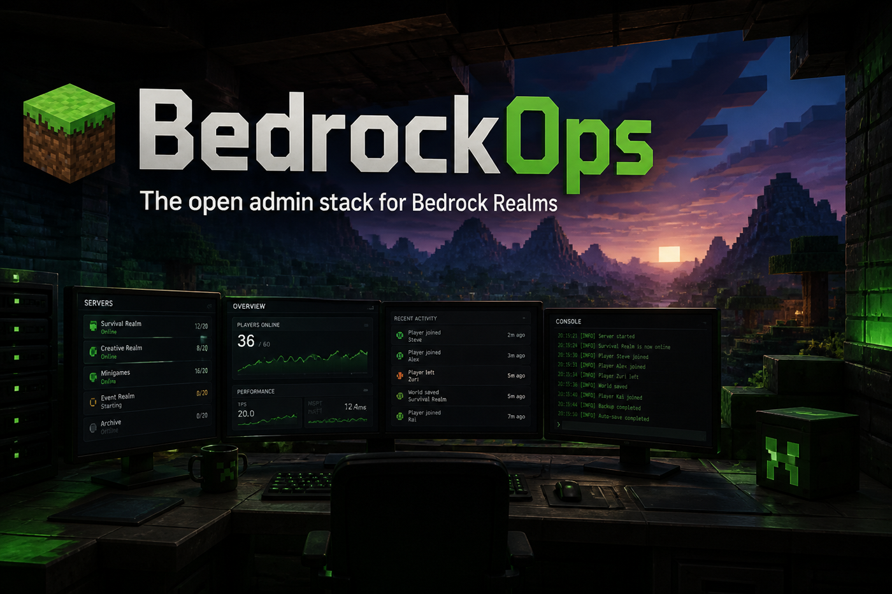
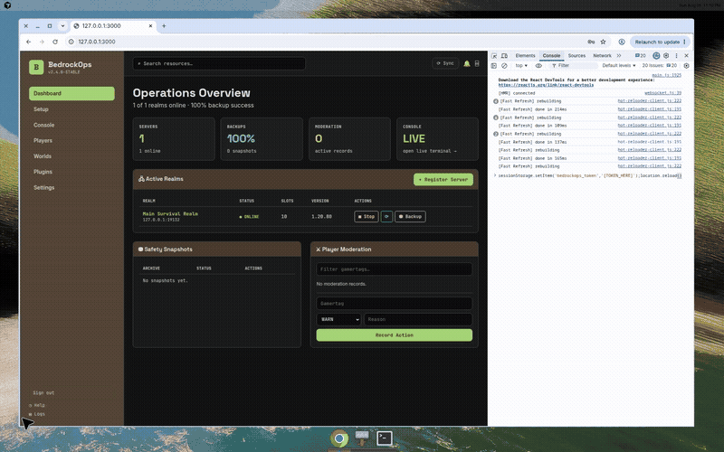
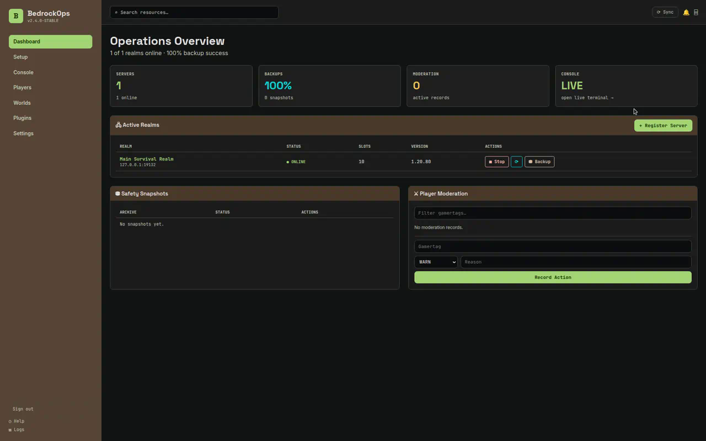
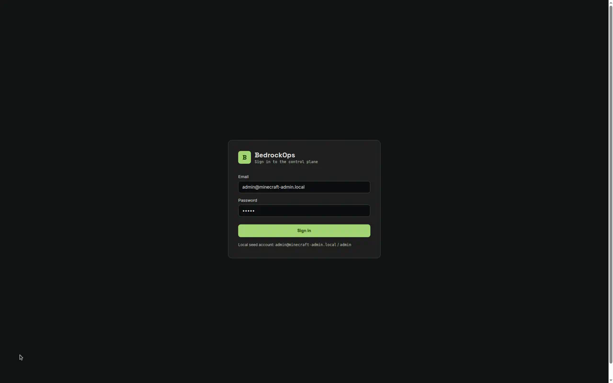
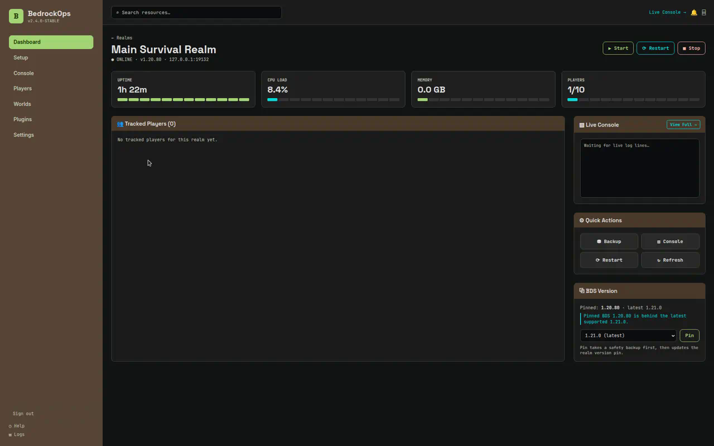
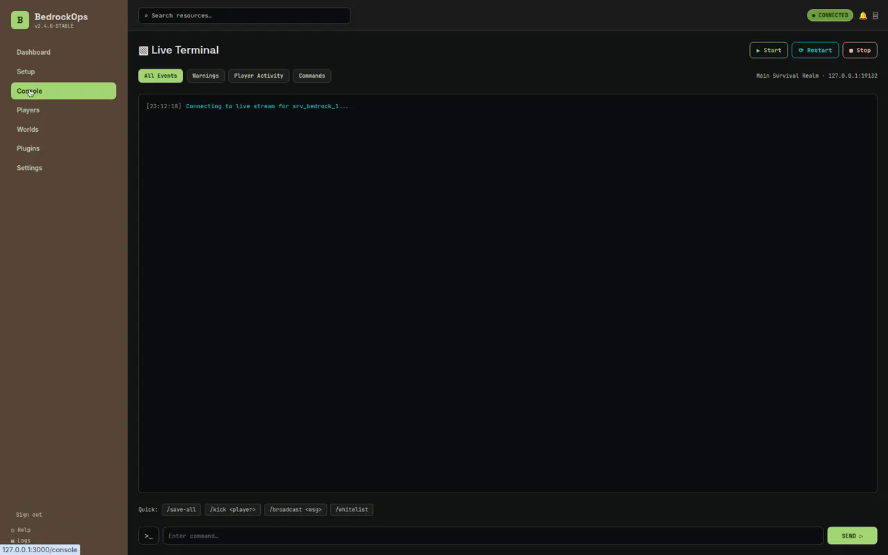
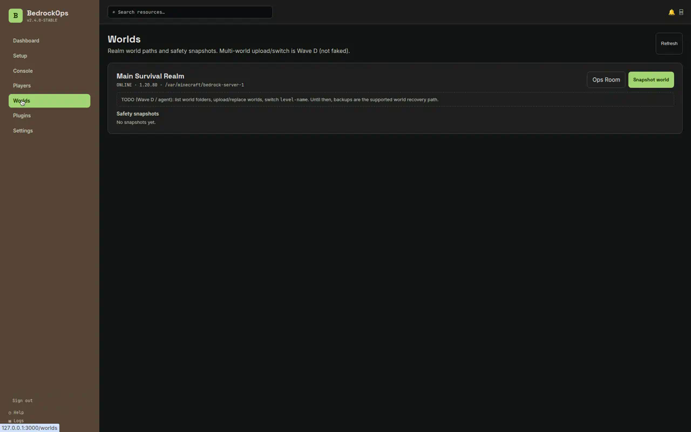
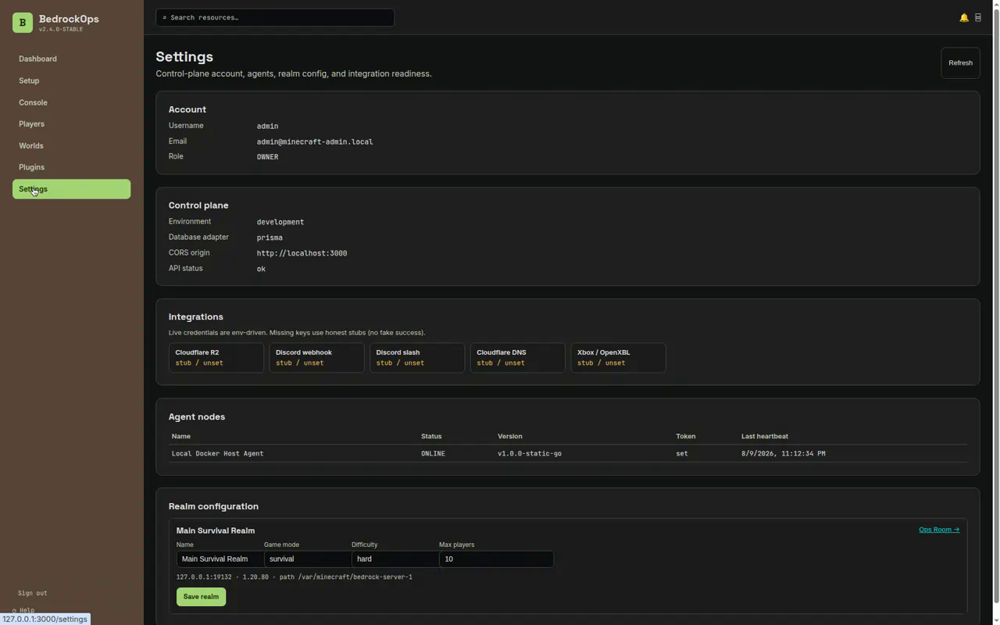
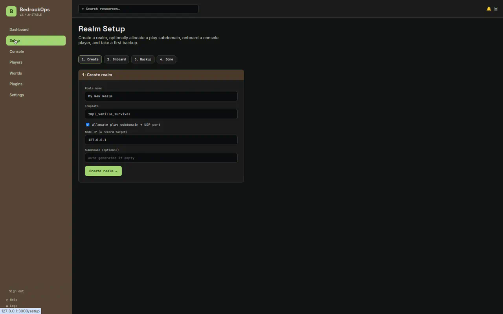
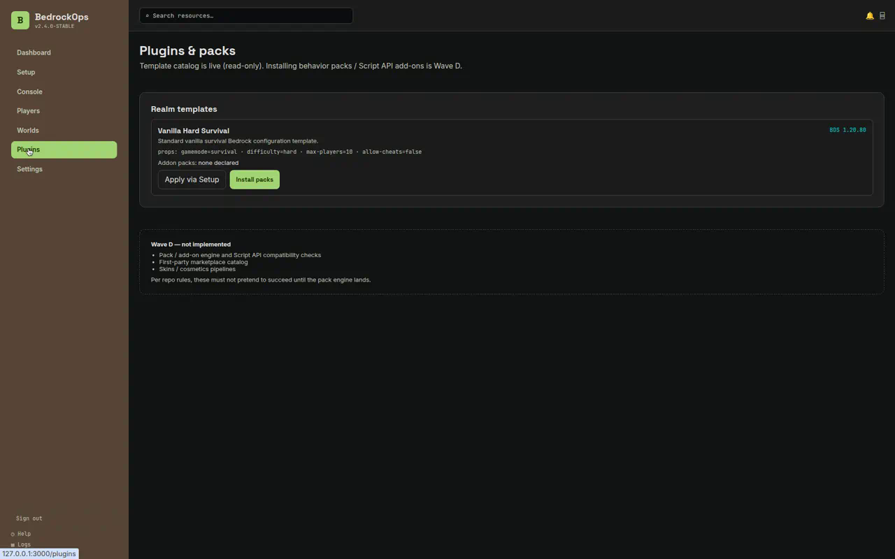

<p align="center">
  
</p>

<h1 align="center">BedrockOps</h1>

<p align="center">
  <strong>The open admin stack for Minecraft Bedrock Realms.</strong><br/>
  Free forever. Fork it. Self-host it. Help us build it.
</p>

<p align="center">
  <a href="#quick-start">Quick start</a> ·
  <a href="#product-tour">Demo</a> ·
  <a href="#why-bedrockops">Why this exists</a> ·
  <a href="#features">Features</a> ·
  <a href="#contributing">Contributing</a>
</p>

---

## Product tour

Real UI. Real pages. Captured from a running local stack.



[Download the full MP4 walkthrough](docs/demo/bedrockops-product-tour.mp4) · poster:

<p align="center">
  
</p>

| Login | Ops Room | Live console |
|:--:|:--:|:--:|
|  |  |  |

| Worlds | Settings | Setup wizard |
|:--:|:--:|:--:|
|  |  |  |

<p align="center">
  
</p>

---

## Why BedrockOps

Running a Bedrock community server should feel like Realms for your players — and like a **real ops console** for your staff.

Most hosting panels stop at “here’s RAM and an FTP box.” You still get:

- mystery crashes with no trail  
- backups that maybe happened  
- moderation that lives in someone’s Discord DMs  
- join flows that confuse console players  
- no audit history when something goes wrong at 2am  

**BedrockOps is different.** It’s a full control plane for self-hosted Bedrock Dedicated Servers:

- a dashboard your admins will actually use  
- a Go agent that dials *out* (works behind home NAT / CGNAT)  
- streaming backups with honest failure modes  
- a moderation ledger with GDPR anonymize  
- Discord alerts, version pins, live console, setup wizard  

**This repo is free.** No paid tier buried in the README. No “contact sales.”  
Fork it. Run it on your VPS, your homelab, your spare PC.  
If you improve it — **please open a pull request.** That’s how this grows.

---

## Who it’s for

| You are… | BedrockOps helps you… |
|----------|------------------------|
| A Realm owner with friends on Xbox / Switch / mobile | Onboard players without tribal knowledge |
| A small community with staff | Moderate with records, not vibes |
| A homelab / VPS operator | Control BDS like a real service |
| A tinkerer who hates fake “success” UIs | Trust the panel — stubs are labeled stubs |
| An open-source contributor | Ship meaningful PRs across Go, TS, and UX |

---

## Features

### Operations that feel intentional

- **Power controls** — start / stop / restart through the agent (not “hope systemctl worked”)
- **Ops Room** — per-realm status, version pin, quick actions
- **Live console** — stream BDS stdout/stderr; send commands when RCON is wired
- **Setup wizard** — create → onboard → first backup without reading twelve wiki pages

### Safety & recovery

- **Streaming backups** — save-hold sequence → agent `tar.gz` archive  
- **Optional Cloudflare R2** — offsite when you set keys; local/agent archive otherwise  
- **Restore with confirmation** — dangerous actions ask first  
- **Crash detection** — unexpected process exit can page Discord  

### People & community

- **Moderation ledger** — WARN / MUTE / KICK / BAN / NOTE  
- **Player tracking** — join ingest + search  
- **GDPR anonymize** — soft-delete path for player data  
- **Allowlist sync** — atomic `allowlist.json` write plan via agent  

### Connectivity that matches how Bedrock is actually played

- **Outbound agent tunnel** — CGNAT-friendly WebSocket to the control plane  
- **Subdomain + UDP port allocation** — play.* style onboarding adapters  
- **Xbox / OpenXBL resolve** — live when keyed; honest stub without  

### Operator polish

- **Settings** — account, agents, integration readiness, realm config  
- **Worlds** — world path + snapshot/restore surface  
- **Plugins / templates** — catalog today; pack install refuses until Wave D (no fake success)  
- **Audit log** — state-changing actions leave a trail  
- **Analytics + rate limits** — destructive-action throttles, join-flood detection  

<p align="center">
  
</p>

---

## Architecture (simple version)

```text
┌────────────┐     REST / WS      ┌────────────┐     outbound WSS     ┌────────────┐
│  Dashboard │ ─────────────────► │    API     │ ◄─────────────────── │  Go agent  │
│  apps/web  │                    │  apps/api  │                      │ apps/agent │
└────────────┘                    └─────┬──────┘                      └─────┬──────┘
                                        │                                   │
                                        ▼                                   ▼
                                   Postgres                            Bedrock BDS
                                   (Prisma)                         (process + files)
```

| Piece | Role |
|-------|------|
| `apps/web` | Operator UI (Next.js) |
| `apps/api` | Auth, REST, agent gateway, audits |
| `apps/agent` | Process/filesystem/RCON on the game host |
| `apps/worker` | Scheduled backup + retention sweeps |
| `apps/discord` | Webhooks / slash-command relay |
| `packages/*` | Shared domain libs (`@mc-admin/*`) |

Deeper map: [PROJECT_PLAN.md](./PROJECT_PLAN.md) · contributor rules: [AGENTS.md](./AGENTS.md) · ship status: [SHIP_READINESS.md](./SHIP_READINESS.md)

---

## Quick start

### Requirements

- **Node.js 18+**
- **pnpm 9** — `corepack enable && corepack prepare pnpm@9.0.0 --activate`
- **Docker** — for Postgres
- **Go 1.22+** — to build the agent (optional for UI-only poking)

### Mac / Linux (recommended)

```bash
git clone https://github.com/ShadowWalkerNC/BedrockOps.git
cd BedrockOps
pnpm install
cp .env.example .env
./scripts/start-local.sh
```

Open **http://localhost:3000/login**

| Field | Value |
|-------|--------|
| Email | `admin@minecraft-admin.local` |
| Password | `admin` |

That’s a local seed account for development. Change it before you expose anything to the internet.

### Windows

```powershell
git clone https://github.com/ShadowWalkerNC/BedrockOps.git
cd BedrockOps
pnpm install
copy .env.example .env
powershell -ExecutionPolicy Bypass -File .\scripts\start-local.ps1
```

Then run **two** terminals (root `.env` uses `PORT=3000` for the website — the API must override to **4000**):

```powershell
# Terminal A — API
$env:PORT="4000"
$env:DB_ADAPTER="prisma"
pnpm --filter @mc-admin/api dev

# Terminal B — dashboard
$env:API_URL="http://localhost:4000"
$env:NEXT_PUBLIC_DEV_AUTO_LOGIN="false"
pnpm --filter @mc-admin/web clean
pnpm --filter @mc-admin/web dev
```

Open http://localhost:3000/login with the same seed login.

> **Avoid OneDrive / iCloud sync folders** for the clone. They corrupt Next.js `.next` caches.  
> If you see `Cannot find module './chunks/vendor-chunks/…'`, run:
>
> ```powershell
> pnpm --filter @mc-admin/web clean
> pnpm --filter @mc-admin/web dev
> ```

### Connect an agent (optional, but this is where it gets fun)

```bash
pnpm --filter @mc-admin/agent agent:build

./apps/agent/bin/bedrock-agent \
  -control-plane http://127.0.0.1:4000 \
  -node-id node_docker_agent_1 \
  -token dev_agent_token_change_me
```

| Mode | How |
|------|-----|
| Simulated lifecycle | Omit `-bds-bin` — perfect for UI demos |
| Live BDS | `./scripts/bds/download-bds.sh && ./scripts/start-local-bds.sh` |

**Real BDS + fake players (Linux x86_64):**

```bash
./scripts/bds/run-bot-e2e.sh                 # download/start BDS + run all bot scenarios
./scripts/bds/run-bot-e2e.sh --with-api      # also assert join ingest + JOIN_FLOOD_DETECTED
# or full stack: ./scripts/start-local-bds.sh then Power → Start, then bots
```

Full guide: [`docs/local-bds-testing.md`](docs/local-bds-testing.md).

Seed token above matches the default Memory/Prisma seed hash. Rotate it for anything real.

---

## Day-2 configuration

Copy `.env.example` → `.env`. Important knobs:

| Variable | Purpose |
|----------|---------|
| `DB_ADAPTER=prisma` | Postgres persistence (recommended) |
| `DATABASE_URL` | Postgres connection string |
| `JWT_SECRET` | Sign dashboard sessions (use a long random string) |
| `NODE_PAIRING_SECRET` | Agent pairing hardness |
| `CORS_ORIGIN` | Your dashboard origin (`http://localhost:3000` locally) |
| `BEDROCK_AGENT_TOKEN` | Must match the agent node’s hashed token |
| `R2_*` | Optional offsite backups |
| `DISCORD_WEBHOOK_URL` | Optional live alerts |
| `CLOUDFLARE_API_TOKEN` + `CLOUDFLARE_ZONE_ID` | Optional live play DNS |
| `XBOX_API_KEY` / `OPENXBL_API_KEY` | Optional live gamertag↔XUID |

**Missing keys never fake success.** Backups, Discord, DNS, and Xbox paths return honest stubs / pending states until configured. That’s a feature.

Production checklist: [SHIP_READINESS.md](./SHIP_READINESS.md)

---

## Useful commands

```bash
pnpm install
pnpm dev                 # workspace apps
pnpm test                # Vitest (+ Go tests in apps/agent)
pnpm typecheck           # full TypeScript (includes tests)
pnpm build
pnpm lint

pnpm --filter @mc-admin/db db:generate
pnpm --filter @mc-admin/db db:migrate
pnpm --filter @mc-admin/web clean
pnpm --filter @mc-admin/agent agent:build
```

---

## Roadmap

| Wave | What | Status |
|------|------|--------|
| **A** | Agent tunnel, RCON, Prisma, R2 backup/restore, security hardening | Shipped on `main` |
| **B** | Moderation, allowlist, subdomain onboarding, Discord | Shipped on `main` |
| **C** | Live console, analytics, rate limits, versions, crash alerts, Settings/Worlds/Plugins | Shipped on `main` |
| **D** | Pack/add-on engine, marketplace, host partners, seasonal rounds | Next — **come help** |

If Wave D excites you (packs, Script API, marketplace UX, Pterodactyl wiring), open an issue or PR. We’ll take serious contributions over vaporware screenshots.

---

## Contributing

**Please contribute.** This project gets better when operators who actually run Realms send patches.

### Great first PRs

- Docs that would have saved *you* an hour  
- Windows / Docker gotchas  
- Empty states and UX copy  
- Tests around bugs you hit  
- Hardening env validation / error messages  
- Real agent edge cases (process exit, pipe drain, allowlist races)  

### Ground rules

1. Read [AGENTS.md](./AGENTS.md) — package boundaries matter.  
2. **No fake stubs.** If a host action didn’t happen, say so.  
3. Audit state-changing ops.  
4. Prefer small, reviewable PRs against `main`.  
5. Keep TypeScript strict; run `pnpm test` / `pnpm typecheck` when you can.

### How to send a change

```bash
git checkout -b fix/my-improvement
# ...make the change...
pnpm test
git push -u origin HEAD
# open a pull request on GitHub
```

Found a bug but can’t code it? [Open an issue](https://github.com/ShadowWalkerNC/BedrockOps/issues) with repro steps. That still helps.

---

## FAQ

**Is this free?**  
Yes. Free to clone, free to fork, free to self-host.

**Do I need to pay for hosting?**  
Only whatever VPS/homelab you already use for Bedrock. BedrockOps itself isn’t a paid panel.

**Does it replace Aternos / Apex / etc.?**  
It doesn’t sell you RAM. It makes *your* Bedrock dedicated server operable like a product.

**Can I run it without R2 / Discord / Cloudflare?**  
Yes. Those integrations light up when configured; otherwise they fail honestly.

**Is Java Edition supported?**  
Bedrock-first by design. Java / Geyser paths are not the primary focus right now.

**Where’s the demo video?**  
Right at the top — GIF preview + [MP4](docs/demo/bedrockops-product-tour.mp4). Screenshots live in [`docs/images/`](docs/images/).

---

## License

**Free to use. Free to fork. Free to improve.**

Take the code. Run your Realms. Send commits back if you can.  
If you publish a public fork, a link to this repo is appreciated.

---

<p align="center">
  <strong>Stop administrating Bedrock with folklore.</strong><br/>
  Fork BedrockOps. Stand up a Realm. Open a PR.
</p>

<p align="center">
  
</p>
