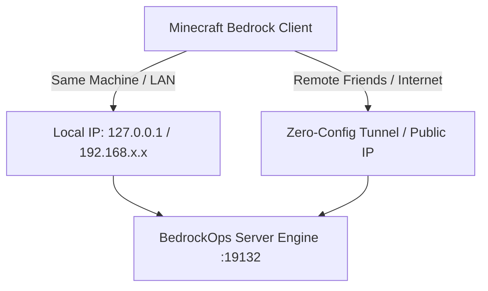
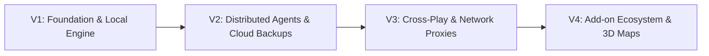

<p align="center">
  
</p>

<h1 align="center">⚡ BedrockOps</h1>

<p align="center">
  <strong>The Ultimate All-in-One Local-First Developer Studio & Self-Contained Ops Hub for Minecraft Bedrock.</strong><br/>
  Deploy, manage, customize, run, and monitor real Bedrock Dedicated Servers directly on your machine with 1-click ease, zero external database setup, and built-in persistence.
</p>

<p align="center">
  
  
  
  
  
</p>

<p align="center">
  <a href="#-why-bedrockops-exists">Why BedrockOps</a> ·
  <a href="#-key-capabilities">Key Capabilities</a> ·
  <a href="#-product-tour">Product Tour</a> ·
  <a href="#-standalone--self-contained-architecture">Architecture</a> ·
  <a href="#-quick-start--installation">Installation Guide</a> ·
  <a href="#-extending--contributing">Developer Guide</a>
</p>

---

## ⚡ 1-Minute Quick Start (Self-Contained & Zero Config)

Anyone can clone and run BedrockOps in under 60 seconds with **zero external database or daemon configuration** required:

### 🪟 Windows (1-Click)
1. Clone the repository:
   ```bash
   git clone https://github.com/ShadowWalkerNC/BedrockOps.git
   cd BedrockOps
   ```
2. Double-click **`start.bat`** (or run `.\start.bat` in PowerShell/Command Prompt).
3. The dashboard opens automatically at **`http://localhost:3000`**!

---

### 🍏 macOS & 🐧 Linux (1-Click)
```bash
git clone https://github.com/ShadowWalkerNC/BedrockOps.git
cd BedrockOps
chmod +x start.sh && ./start.sh
```

---

### 🐳 Docker Compose (Optional Multi-Service Mode)
```bash
docker compose up -d
pnpm dev
```

---

## 🎮 Complete Player & Connection Guide (Local & Remote Play)

Here is everything you and your players need to know to connect, fix version mismatches, and play together:



---

### 1. 🖥️ Connecting from the Same PC (Windows Loopback Exemption)
By default, Windows blocks Universal Windows Platform (UWP) apps like Minecraft Bedrock from connecting to servers hosted on `127.0.0.1` (localhost).
* **1-Click Fix in BedrockOps:** Go to **[Diagnostics Center (`/diagnostics`)](http://localhost:3000/diagnostics)** and click **"Grant Loopback Exemption"**.
* **Or Run in PowerShell:**
  ```powershell
  CheckNetIsolation LoopbackExempt -a -n="Microsoft.MinecraftUWP_8wekyb3d8bbwe"
  ```
* In Minecraft: Add Server $\rightarrow$ Server Name: `Local Host`, Server Address: `127.0.0.1`, Port: `19132`.

---

### 2. 🔄 Matching Minecraft Versions & Downloading Specific/Older Versions
Bedrock Dedicated Servers (BDS) reject connections if your game client is on an incompatible version (e.g. running a **Beta / Preview build** like `1.21.120` against a standard release server like `1.21.73`).

#### How to Switch Versions with Bedrock Launcher:
1. BedrockOps includes a 1-click launcher helper:
   ```powershell
   pnpm run bds:launcher
   ```
   *(Or download free from [bedrocklauncher.github.io](https://bedrocklauncher.github.io/))*
2. In Bedrock Launcher:
   * Go to **Versions** $\rightarrow$ Click **Add Version**.
   * Choose your desired release (e.g. **Official Release `1.21.73.01`** or any older version).
   * Launch your chosen version with 1-click!
3. **Verify in BedrockOps:** Visit **`/diagnostics`** to run the built-in **Client Version Simulator** to ensure your server and client match 100%.

---

### 3. 🌐 Playing with Outside Friends Over the Internet (No Local Wi-Fi Needed)

#### Option A: Zero-Config Remote UDP Tunnel *(Recommended — No Router Setup)*
1. Run the built-in tunnel manager:
   ```powershell
   pnpm run bds:tunnel
   ```
2. Click the setup link in your terminal to claim your free tunnel.
3. Select **Minecraft Bedrock (UDP)** $\rightarrow$ Port **`19132`**.
4. You will get a permanent public address (e.g. **`myrealm.playit.gg:19132`**).
5. **How friends join:** Friends on iOS, Android, Xbox, Switch, and PC simply type `myrealm.playit.gg` in their Minecraft Server list!

#### Option B: Direct Router Port Forwarding *(Lowest Ping)*
1. In your home router settings, forward **UDP Port 19132** to your PC's local IP address (e.g. `192.168.x.x`).
2. Find your public IP address (via [whatismyip.com](https://www.whatismyip.com)).
3. Friends type your **Public IP** and Port **`19132`** to join!

---

### 4. 🎮 Console Players (Xbox, PlayStation, Nintendo Switch)
Consoles do not allow entering custom server IPs directly by default. BedrockOps provides two seamless ways for console players to join:
* **Phantom LAN Broadcast (`packages/lan-discovery`):** Broadcasts your server as a local LAN game so friends on the same Wi-Fi see it appear directly under the "Friends / LAN Games" tab!
* **BedrockTogether / MC Server Connector App:** Players on Xbox/PlayStation/Switch can open the free "BedrockTogether" app on their phone (connected to the same Wi-Fi), enter your server address, and the server will appear in their console's Friends tab immediately.

---

## 💡 Why BedrockOps Exists

While Minecraft Java Edition has enjoyed a decade of robust server management stacks (Pterodactyl, Crafty Controller, Paper, Spigot), **Minecraft Bedrock Edition represents over 80% of active players worldwide**—yet its server hosting, moderation, and developer tools remain fragmented.

Minecraft server owners struggle daily with:
* **The Console IP Barrier**: Xbox, PlayStation, and Nintendo Switch players cannot easily enter custom server IPs without router DNS tricks.
* **The Plugin API Vacuum**: Standard Bedrock Dedicated Server (BDS) lacks event hooks, permission levels, or detailed player logging out-of-the-box.
* **Complex Addon Installation**: Installing Behavior Packs, Resource Packs, and Script API addons requires unzipping, matching UUIDs, and editing JSON manifests manually.
* **Home NAT & CGNAT Firewalls**: Hosting a server at home for friends requires manual port forwarding, which is often blocked by ISPs.

**BedrockOps bridges these gaps.** It is a standalone local-first developer studio and virtual control plane that installs directly on your local computer to download, configure, run, and monitor Bedrock servers with 1-click ease.

---

## 🚀 Key Capabilities

### ⚡ 1. Local Native Server Runner & Addon Loader
* **Direct Process Spawning**: Spawns real `bedrock_server.exe` / `bedrock_server` native binaries directly on your machine.
* **Automatic Mojang BDS Downloader**: Downloads and extracts official Bedrock Dedicated Server binaries directly from Mojang's CDN.
* **Auto-Discovery for Mods & Behavior/Resource Packs**: Automatically scans `behavior_packs/` and `resource_packs/` on server boot, parses pack UUIDs, and synthesizes `world_behavior_packs.json` and `world_resource_packs.json` automatically without manual editing.
* **Disk Workspace Management**: Keeps all server files neatly organized under `data/servers/<server_id>/` with dynamic `server.properties` synthesis.

### 🖥️ 2. Live Terminal & Interactive RCON Shell
* **Real-Time Logs & WebSockets**: Instant log streaming and server metrics broadcast over bidirectional WebSockets.
* **1-Click Action Chips**: Execute quick commands (`/list`, `/status`, `/help`, `/save-all`, `/stop`, `/kick`, `/broadcast`) with a single click.
* **Interactive RCON Shell**: Dispatch custom in-game slash commands directly to the running server with immediate live output streaming.

### 👥 3. Multi-User RBAC & Zero-Config Persistence (`LocalFileStore`)
* **LocalFileStore Persistence**: Automatically snapshots and restores the entire database state to local files with zero external database dependencies.
* **Multi-User RBAC**: Manage operator accounts with distinct roles (`OWNER`, `ADMIN`, `MODERATOR`, `VIEWER`) directly in the Web GUI.
* **Infraction History & Allowlist Sync**: Issue and persist warn, mute, kick, and ban logs; atomically sync `allowlist.json`.

### 🌉 5. Console & Network Proxying
* **Phantom LAN Broadcast**: Broadcasts local servers on the local Wi-Fi network so Xbox, PlayStation, and Nintendo Switch players see them in the "LAN Games" tab.
* **GeyserMC & Floodgate**: Integrated Java & Bedrock cross-play bridging.
* **WaterdogPE Proxy**: Multi-server proxying and hub networking.

---

## 🎨 Product Tour

Captured from a live running local development stack:


| Login Screen | Guided Setup Wizard | Operations Overview |
|:--:|:--:|:--:|
|  |  |  |

| Live Ops Room & Telemetry | Live Console & RCON Shell | Customizations & Plugins |
|:--:|:--:|:--:|
|  |  |  |

---

## ⚡ Supported Server Engines

BedrockOps is a multi-engine hub designed to orchestrate various server types inside a sandboxed local environment:

* **Official Vanilla BDS (Mojang Dedicated Server)**: Downloads official Bedrock Dedicated Server binaries directly from the Mojang CDN.
* **⚡ Endstone (`endstonemc/endstone`)**: BDS wrapped with C++ native binary hooks & Python plugin support, bringing Spigot/Bukkit-like event hooks, custom commands, and moderation scripts.
* **Script API / Behavior Pack Companion**: Vanilla BDS configured for custom Bedrock addons and behavior packs.
* **PocketMine-MP**: PHP-based high-performance Bedrock server engine.

---

## ⚙️ Standalone & Self-Contained Architecture

BedrockOps is designed to run completely self-contained on your local machine with automatic file persistence:

```text
┌────────────────────────────────────────────────────────────────────────────────────────┐
│                                 BedrockOps Operations Hub                              │
│                                                                                        │
│  ┌─────────────────────────┐               REST / WS                ┌─────────────────────────┐│
│  │   React Web Dashboard   │ ──────────────────────────────────────► │    Core API Backend     ││
│  │       (apps/web)        │                                        │       (apps/api)        ││
│  │  http://localhost:3000  │ ◄───────────────────────────────────── │  http://localhost:4000  ││
│  └─────────────────────────┘                                        └────────────┬────────────┘│
│                                                                                  │             │
│        ┌─────────────────────────────────────────────────────────────────────────┴────┐        │
│        ▼                                                                              ▼        │
│  ┌───────────────────────────┐                                          ┌─────────────────────┐│
│  │  Local BDS Process Runner │                                          │   LocalFileStore    ││
│  │    (LocalServerRunner)    │                                          │ (Local Persistence) ││
│  │ Native Server Execution   │                                          │ Zero-Config Storage ││
│  └───────────────────────────┘                                          └─────────────────────┘│
└────────────────────────────────────────────────────────────────────────────────────────┘
```

### Monorepo Workspace Package Map

* `apps/web`: React / Next.js web interface, Live Terminal, RBAC management, and Guided Setup wizard.
* `apps/api`: REST & WebSocket backend control plane (Express), RBAC middleware, and system endpoints.
* `packages/db`: `LocalFileStore` persistent storage, MemoryDatabase, and Prisma schema adapter.
* `packages/bedrock`: Native server runner (`LocalServerRunner`), BDS downloader (`BdsDownloader`), RCON client, and Endstone configuration.
* `packages/backups`: Snapshot engine, integrity manifests, and world restore validation.
* `packages/moderation`: Player identity tracking, persistent infraction ledger, and atomic allowlist writer.
* `packages/templates`: Mode catalog templates and pack manifest synthesizer (`world_behavior_packs.json`).
* `packages/notifications`: Discord rich embed payload generator and webhook dispatcher.

---

## 🏁 Quick Start & Installation

BedrockOps works **out-of-the-box with zero external database setup required** (defaults to an in-memory pre-seeded database).

### Prerequisites
* **Node.js 18+**
* **pnpm 9** — Enable via: `corepack enable && corepack prepare pnpm@9.0.0 --activate`

---

### 💻 Windows Setup

1. **Clone the repository**:
   ```powershell
   git clone https://github.com/ShadowWalkerNC/BedrockOps.git
   cd BedrockOps
   ```

2. **Install dependencies**:
   ```powershell
   pnpm install
   ```

3. **Start Development Stack**:
   ```powershell
   # Run both API (port 4000) and Web Dashboard (port 3000)
   pnpm dev
   ```

4. **Launch BedrockOps**:
   Open **http://localhost:3000** in your browser!
   * **Dev Login Credentials**: `admin@minecraft-admin.local` / `admin`

---

### 🍎 macOS & 🐧 Linux Setup

1. **Clone & Install**:
   ```bash
   git clone https://github.com/ShadowWalkerNC/BedrockOps.git
   cd BedrockOps
   pnpm install
   ```

2. **Start Stack**:
   ```bash
   ./scripts/start-local.sh
   ```

3. **Launch BedrockOps**:
   Open **http://localhost:3000** (Login: `admin@minecraft-admin.local` / `admin`).

---

## 🗺️ Development Roadmap & Help Needed

We are actively building the ultimate Bedrock server operations platform. Here is the current development roadmap, what features are in progress, and **where we need help from the open-source community**:



### 🟢 Completed & Operational in V1
* [x] **Native BDS Process Runner** — Direct process lifecycle management (`bedrock_server.exe` / `bedrock_server`).
* [x] **Live RakNet Packet Diagnostics** — Low-latency UDP unconnected ping returning MOTD, protocol, player count, and latency.
* [x] **Real-Time Operations Room** — Continuous 3-second live telemetry sync (CPU, RAM, Uptime, Active Players).
* [x] **Zero-Config Remote Play Tunneling** — Integrated `playit.gg` UDP tunnel manager (`pnpm run bds:tunnel`) for outside friend connections without port forwarding.
* [x] **1-Click Diagnostics & Auto-Fixers** — Windows loopback exemption, firewall configuration, and `online-mode` toggle.
* [x] **Marketplace & Addon Synthesis** — Manifest synthesis for Behavior Packs, Resource Packs, and Endstone plugins.
* [x] **Player Ledger & History** — Join/leave tracking, XUID resolution, and moderation ledger (Ban, Kick, Mute, Warn, Note).
* [x] **Universal 1-Click Launchers** — `start.bat` (Windows) and `start.sh` (macOS/Linux) with zero-config in-memory DB.

---

### 🟡 Features In Progress & Looking for Contributors (Help Needed!)

We would love community help with the following features:

#### 1. 🛰️ Distributed Outbound Go Agent Multi-Node Clustering (`apps/agent`)
* **Goal:** Connect remote VPS nodes and home servers behind CGNAT firewalls to a single BedrockOps web dashboard via an outbound WebSocket tunnel gateway.
* **Help Needed:** Implementing binary process supervision, automated BDS updates on Linux, and resource throttling in the Go agent daemon (`apps/agent`).

#### 2. ☁️ Cloudflare R2 / AWS S3 Direct Streaming Backups (`packages/backups`)
* **Goal:** Stream compressed `tar.gz` world backups directly to Cloudflare R2 / S3 presigned URLs without buffering huge files to local disk first.
* **Help Needed:** Completing the streaming multipart upload adapter and retention policy pruning sweep.

#### 3. 🎮 GeyserMC & Floodgate Cross-Play Pipeline (`packages/geyser`)
* **Goal:** Allow Java Edition players to join Bedrock servers (and Bedrock players to join Java servers) with 1-click proxy provisioning.
* **Help Needed:** Wiring the automated Geyser config generator and Floodgate keypair synchronizer.

#### 4. 🤖 Discord Bot Command & Alert Dispatcher (`apps/discord`)
* **Goal:** Manage your Bedrock server directly from your Discord server.
* **Help Needed:** Building Discord slash commands (`/server status`, `/server restart`, `/player kick`, `/backup create`) and embed webhook alerts for join floods or crashes.

#### 5. 🗺️ 3D Interactive World Map Web Renderer
* **Goal:** View your Minecraft world directly in the BedrockOps dashboard.
* **Help Needed:** Integrating a headless Bedrock LevelDB chunk renderer (e.g. PapyrusCS, BlueMap, or Chunky) into a new tab in `apps/web/src/pages/worlds/map.tsx`.

#### 6. 🛡️ Advanced Anti-Cheat & Packet Anomaly Detection
* **Goal:** Protect public Bedrock servers from malicious join floods, speed hacks, and packet crash exploits.
* **Help Needed:** Enhancing the log anomaly analyzer to detect rapid connection floods and automate temporary firewall IP drop rules.

---

## 🛠️ Extending & Contributing

We welcome contributions from Minecraft server operators, addon creators, and open-source developers!

### Quick Contribution Workflow
1. **Fork the repo** and clone your fork.
2. **Install dependencies**: `pnpm install`
3. **Start local dev**: `pnpm dev` (or run `start.bat` on Windows / `start.sh` on Mac/Linux)
4. **Run test suite**: `pnpm test` (Ensure all 226+ tests pass!)
5. **Verify typecheck**: `pnpm typecheck`
6. **Submit a Pull Request** with a description of what you implemented!

---

## 📄 License

**Free forever. Open source (MIT).** Fork it, host it, improve it, and run your Bedrock servers with complete ownership.
